# Lintex Config And Deployment Logs

## Goal

Use a private `dailin3/lintex-config` repository to manage Docker Compose files,
deployment scripts, and environment templates. Extend `lintex-webhook` to load a
service allowlist, update the config checkout, execute deployments, and expose
persistent CI-style logs remotely.

## Repositories

| Repository | Visibility | Responsibility |
| --- | --- | --- |
| `lintex-login` | Existing | Application source, Dockerfile, image CI |
| `lintex-webhook` | Public | Authenticated deployment service and releases |
| `lintex-config` | Private | Compose files, deployment scripts, env templates |

No real secret is committed to any repository.

## Server Layout

The private config repository is cloned to `/opt/lintex-config`:

```text
/opt/lintex-config/
├── .gitignore
├── README.md
├── services.toml
└── lintex-login/
    ├── compose.yaml
    ├── deploy.sh
    ├── .env.example
    └── .env
```

`.env` exists only on the server and is ignored by Git. `.env.example` contains
variable names and empty values only.

The server accesses the private repository with a read-only GitHub Deploy Key.

## Deployment Flow

```mermaid
flowchart LR
    A[GitHub Actions] -->|POST /deploy/lintex-login| B[lintex-webhook]
    B --> C[Create run ID and log]
    C --> D[git pull --ff-only]
    D --> E[Read services.toml]
    E --> F[Run lintex-login/deploy.sh]
    F --> G[docker compose pull]
    G --> H[docker compose up -d]
    H --> I[HTTP health check]
    I --> J[Store status, exit code, and logs]
```



The request cannot provide a command, script path, working directory, Compose
file, or image. Only services declared in `services.toml` may run.

## Config Repository

### `.gitignore`

```gitignore
**/.env
**/.env.production
```

### `services.toml`

```toml
[services.lintex-login]
display_name = "Lintex Login"
working_directory = "/opt/lintex-config/lintex-login"
deploy_script = "/opt/lintex-config/lintex-login/deploy.sh"
```

### `lintex-login/.env.example`

```env
TURNSTILE_SECRET=
```

### `lintex-login/compose.yaml`

```yaml
services:
  login:
    image: crpi-5k1h8laml9223z4c.cn-beijing.personal.cr.aliyuncs.com/lintex/login:latest
    container_name: lintex-login
    restart: unless-stopped
    env_file:
      - .env
    ports:
      - "127.0.0.1:3000:3000"
```

### `lintex-login/deploy.sh`

The script checks that `.env` exists, prints each safe command, runs Compose,
and checks `http://127.0.0.1:3000/auth/login`. It uses `set -Eeuo pipefail` but
not `set -x`, preventing accidental secret output.

The Webhook performs `git pull --ff-only` before invoking the script. The script
does not update its own repository.

## Webhook Configuration

The Webhook reads:

| Variable | Required | Description |
| --- | --- | --- |
| `WEBHOOK_TOKEN` | Yes | Bearer token for all protected endpoints |
| `CONFIG_REPOSITORY` | No | Default `/opt/lintex-config` |
| `SERVICES_CONFIG` | No | Default `/opt/lintex-config/services.toml` |
| `RUNS_DIRECTORY` | No | Default `/var/lib/lintex-webhook/runs` |
| `LISTEN_ADDR` | No | Default `127.0.0.1:9000` |
| `RUST_LOG` | No | Webhook process log filter |

`DEPLOY_SCRIPT` is removed after migration to the service configuration.

## HTTP API

All endpoints except `/health` require the same bearer token.

| Method and path | Result |
| --- | --- |
| `GET /health` | Webhook process health |
| `POST /deploy/:service` | Start an allowed service deployment |
| `GET /runs` | List recent deployment runs |
| `GET /runs/:id` | Run metadata and result |
| `GET /runs/:id/log` | Complete plain-text terminal log |
| `GET /runs/:id/stream` | Live log stream using SSE |

`POST /deploy/:service` returns `202` with a run ID. Unknown services return
`404`, invalid authentication returns `401`, and an already running deployment
returns `409`.

## Run Storage And Logs

Each run has a UUIDv7 ID and a directory under `RUNS_DIRECTORY`:

```text
/var/lib/lintex-webhook/runs/<run-id>/
├── metadata.json
└── output.log
```

Metadata includes service, status, start time, finish time, elapsed time, and
exit code. Status is one of `running`, `succeeded`, or `failed`.

`output.log` contains timestamped command markers and unmodified stdout/stderr
lines. It must never contain the bearer token, environment file contents, Git
credentials, or registry passwords.

Runs are retained for 30 days and at most 500 runs. Cleanup occurs after a new
run is created; entries exceeding either limit are deleted oldest first.

Journald remains responsible only for Webhook process lifecycle and unexpected
service errors. Deployment output belongs to run storage.

## Webhook Release And Installation

The existing CI continues to create Actions Artifacts for pushes to `master`.
Only `v*` tags create GitHub Releases.

The repository includes:

- an updated systemd service with write access to `/var/lib/lintex-webhook` and
  `/opt/lintex-config`;
- a systemd tmpfiles entry for the persistent run directory;
- installation documentation;
- no automatic Webhook self-updater in this change.

Webhook automatic updates will be designed after this deployment workflow has
been used successfully.

## Testing

Tests cover service config parsing, unknown services, authentication, config
repository update failure, successful and failed scripts, persistent metadata,
complete log retrieval, SSE delivery, concurrency rejection, and retention.

Validation includes Rust formatting, Clippy with warnings denied, all tests,
shell syntax checks, Compose parsing, secret scanning, and an end-to-end smoke
run with harmless local commands.
