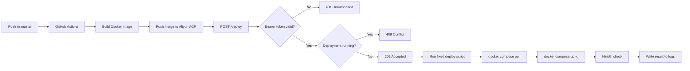

# Lintex Login Deployment Webhook

## Goal

Build a small Rust webhook that deploys only `lintex-login` after GitHub Actions
pushes a new Docker image to Aliyun ACR.

## Flow



The webhook returns immediately after starting the deployment. Deployment
progress is written to the service logs.

## API

### `GET /health`

Checks whether the webhook process is running. Authentication is not required.

Response:

```http
HTTP/1.1 200 OK
Content-Type: application/json
```

```json
{
  "status": "ok"
}
```

### `POST /deploy`

Starts a `lintex-login` deployment.

Request:

```http
POST /deploy HTTP/1.1
Authorization: Bearer <WEBHOOK_TOKEN>
```

The endpoint accepts no request body and no deployment parameters.

Accepted response:

```http
HTTP/1.1 202 Accepted
Content-Type: application/json
```

```json
{
  "status": "accepted",
  "request_id": "019faa3c-92c8-7610-ba6f-0d538fbdfe2c"
}
```

Error responses:

| Status | Meaning |
| --- | --- |
| `401 Unauthorized` | Bearer token is missing or invalid |
| `409 Conflict` | A deployment is already running |

Errors use the same JSON shape:

```json
{
  "status": "error",
  "message": "deployment already running"
}
```

## Deployment Script

The webhook runs one fixed script configured by the server administrator. The
request cannot select a command, image, project, or file path.

The script performs:

```bash
docker compose pull
docker compose up -d --remove-orphans
curl --fail --retry 10 --retry-delay 2 http://127.0.0.1:3000/auth/login
```

The real script will set its Compose directory explicitly and stop when any
command fails.

## Configuration

| Variable | Required | Description |
| --- | --- | --- |
| `WEBHOOK_TOKEN` | Yes | Long random token shared with GitHub Actions |
| `DEPLOY_SCRIPT` | Yes | Absolute path to the fixed deployment script |
| `LISTEN_ADDR` | No | Listen address, default `127.0.0.1:9000` |
| `RUST_LOG` | No | Log filter, default `lintex_webhook=info` |

The token is stored in a systemd environment file and in GitHub Actions
Secrets. It is never committed to Git.

## Logging

Logs go to standard output and are collected by journald. Each deployment has a
request ID. The service logs:

- request accepted or rejected;
- request ID;
- deployment start and finish time;
- script stdout and stderr;
- exit status and elapsed time.

Because deployment is asynchronous, script launch and execution failures are
reported in logs after the endpoint has returned `202`.

The bearer token and other credentials must never appear in logs.

View logs on the server with:

```bash
journalctl -u lintex-webhook -f
```

## Scope

The first version uses Rust, Axum, and Tokio. It runs as a systemd service on
the Docker host and permits only one deployment at a time.

It does not include multiple projects, a database, a queue, a web dashboard, or
automatic rollback.

## Verification

Tests cover the health endpoint, token authentication, deployment triggering,
concurrent request rejection, and releasing the deployment lock after success
or failure. Before release, run `cargo fmt`, `cargo clippy`, and `cargo test`.
